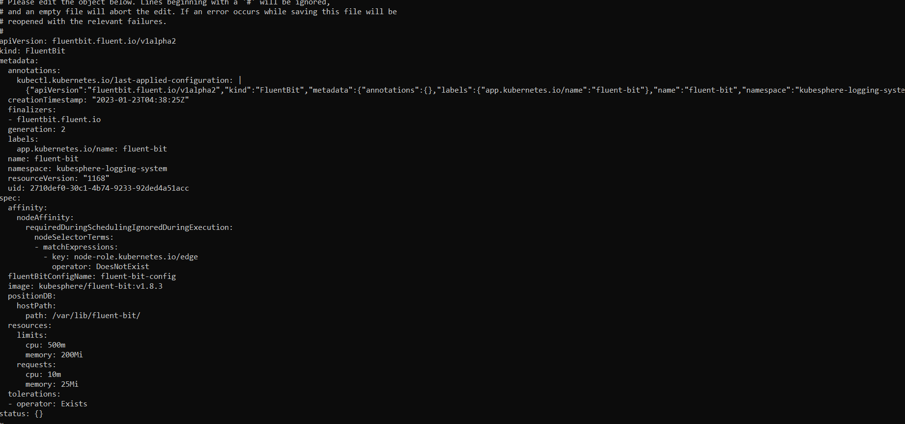

## Building a Fluentbit Log pipeline using the FLuent Operator
In this lab you'll learn how to :
* Look at the exisiting configuration of Fluentbit
* Enrich the logs using a fluentbit Filter plugin
* Structure the enriched logs to Send the logs to dynatrace
* use the otlp http exporter

### Step 1: Enrich the logs with Kubernetes Labels

A. Go to the folder of the exercice :

   In the Bastion host, go to o the folder : `exercise/04_Fluent`

   ```bash
   (bastion)$ cd ~/HOT_DAY_SCRIPT
   (bastion)$ cd exercise/04_Fluent
   ```

B. Look at  the Fluentbit configuration

The cluster has already Fluentbit agents running in the cluster.
Let's first have a look a the various fluenbit objects deployed in the cluster
   ```bash
   kubectl get  FluentBit.fluentbit.fluent.io -n kubesphere-logging-system
   ```


With the desplayed named, let's describe to see the configuration of this object :
   ```bash
   kubectl edit FluentBit.fluent.io <Fluentbit naùe> -n kubesphere-logging-system
   ```


This object is defining that a fluentbit daemonset will be deployed in the namespace `kubesphere-logging-system` of the cluster
This object map to a specific configuration object : `fluent-bit-config`

C. Look at the ClusterFluentBitConfig
   ```bash
   kubectl describe ClusterFluentBitConfig.fluentbit.fluent.io fluent-bit-config
   ```


   This object will map the various steps that would be involved in our Log ingest pipeline :
  ```yaml
   service:
     parsersFile: parsers.conf
   inputSelector:
     matchLabels:
       fluentbit.fluent.io/enabled: "true"
   filterSelector:
     matchLabels:
       fluentbit.fluent.io/enabled: "true"
   outputSelector:
     matchLabels:
       fluentbit.fluent.io/enabled: "true"
  ```
This object will define label that attach the ClusterInput objects ( to collect logs ) , ClusterFilter objects and the ClusterOutput objects of our pipeline.

D. Look at the ClusterInput
   
   ```bash
   kubectl get ClusterInput.fluentbit.fluent.io
   ```

 

   Describe this object
  
   ```bash
   kubectl describe ClusterInput.fluentbit.fluent.io <CLusterinptu Name>
   ```
   The clusterinput is currently collecting the logs for our pods with the help of the Tail plugin :
   ```yaml
   tail:
     tag: kube.*
     path: /var/log/containers/*.log
     parser: cri
     refreshIntervalSeconds: 10
     memBufLimit: 10MB
     skipLongLines: true
     db: /fluent-bit/tail/pos.db
     dbSync: Normal
   ```
E. Look at the ClusterOutput

  ```bash
   kubectl get ClusterOutput.fluentbit.fluent.io
   ```

   

   Describe this object

   ```bash
   kubectl describe ClusterOutput.fluentbit.fluent.io <CLusteroutput Name>
   ```
   Fluentbit is currently sending the collected logs in the stdout of the Fluentbit Pods.

F. Look at the logs of the fluentbit Pods
  ```bash
   kubectl get pods -n kubesphere-logging-system
   ```


   let's display the logs currently parsed by Fluentbit:
   ```bash
      kubectl logs <podid> -n kubesphere-logging-system
   ```


### Step 2. Add kubernetes labels

A. Let's enrich the logs by adding the kubernetes information
   Fluentbit has a filter plugin named `kubernetes`
   This plugin will interact with the k8S api to add the right labels to our logs.
   
   Let's add a new Filter step in our current log pipeline.

   in the bastion host , create a there a cluster filter template file located in `exercice/04_Fluent/` let's edit the following file :
   ```bash
   vi cluster_filter_template.yaml
   ```
   
   We will add a filter step in our pipeline with the help of a `ClusterFilter` object.
   In the CLusterfilter object we will add several steps .
   To add the kubernetes labels, we will use kubernetes:
   ```yaml
   - kubernetes:
       kubeURL: https://kubernetes.default.svc:443
       kubeCAFile: /var/run/secrets/kubernetes.io/serviceaccount/ca.crt
       kubeTokenFile: /var/run/secrets/kubernetes.io/serviceaccount/token
       labels: true
       annotations: true
   ```

   Let's add this filter step by running this command: 
   ```bash
   kubectl apply -f cluster_filter_template.yaml -n kubesphere-logging-system
   ```

   Now let's have a look at the new format of the logs processed by Fluenbit.
   ```bash
   kubectl logs <podid> -n kubesphere-logging-system
   ```
   The fluent operator takes few seconds to load the new pipeline, but you should see a kubernetes object added in our logs.

   
   
B. Lift the kubernetes information in the log stream 
 
   the kubernetes filter has added a new json object with all the kubernetes information.
   Let's move the information to our logs.

   Fluentbit filter has a `nest` plugin to lift data from a json object , let's add to our  Clusterfilter a lift operation.
   ```bash
   vi cluster_filter_template.yaml
   ```

   Add after the kubernetes filter, nest: 
   ```yaml
  - nest:
       operation: lift
       nestedUnder: kubernetes
       addPrefix: kubernetes_
   ```
   this step will lift all the attributes of the new json object to our logs stream , and will add a prefix in front of each new attributes.

   Now let's have a look at the new format of the logs processed by Fluenbit.
   ```bash
   kubectl apply -f cluster_filter_template.yaml -n kubesphere-logging-system
   kubectl logs <podid> -n kubesphere-logging-system
   ```
   We can see that there is json object holding the kubernetes labels, we can do the the same operation by lifting kubernetes_labels
   ```bash
   vi cluster_filter_template.yaml
   ```

   Add after the kubernetes filter, nest: 
   ```yaml
   - nest:
     operation: lift
     nestedUnder: kubernetes_labels
   ```
     
   Now let's have a look at the new format of the logs processed by Fluenbit.
   ```bash
   kubectl apply -f cluster_filter_template.yaml -n kubesphere-logging-system
   kubectl logs <podid> -n kubesphere-logging-system
   ```

### Step 3. The name the log labels
   
   To be aligned the log structure with dt log ingest API we will rename labels and remove unuseful information.
   Fluentbit has a plugin `modify`.

   let's edit our cluster filter: 
 ```bash
      vi cluster_filter_template.yaml
   ```
   by adding an extra filter step:
   ```yaml
   - modify:
       rules:
         - remove: stream
         - remove: kubernetes_container_hash
         - rename:
             message: content
             log: content
             date: timestamp
             kubernetes_pod_name: k8s.pod.name
             kubernetes_namespace_name: k8s.namespace.name
             kubernetes_pod_id: k8s.pod.uid
             kubernetes_host: k8s.kubernetes_node
         - add:
             k8s.kubernetes.cluster.id: CLUSTER_ID_TOREPLACE
             k8s.cluster.name: Hotday2023
   ```

   The cluster id can be retrieved running the following command :
```bash
   kubectl get namespace kube-system -o jsonpath='{.metadata.uid}'
   ```
  Now let's have a look at the new format of the logs processed by Fluenbit.
   ```bash
   kubectl apply -f cluster_filter_template.yaml -n kubesphere-logging-system
   kubectl logs <podid> -n kubesphere-logging-system
   ```
   
   
