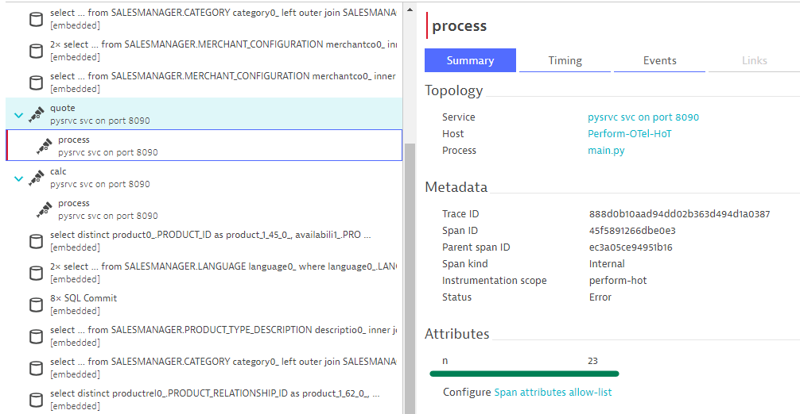
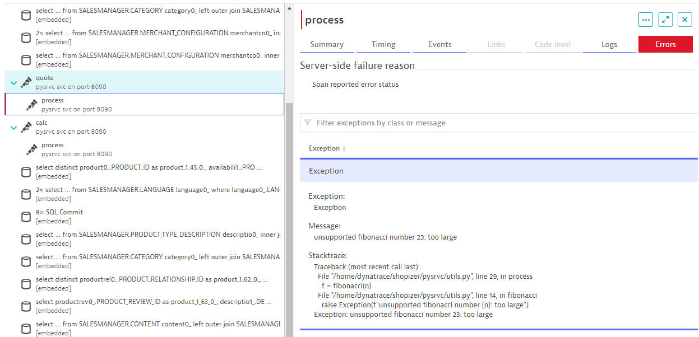

## 3. Customizing Spans for better insights

---

## Introduction

While tracing provides us the most basic visibility into our transactions and allows to see the end-to-end picture, in most cases there will be a need to capture additional detail relevant to troubleshooting problems.

In this exercise you'll modify your previously created Spans to capture additional details.

## 📑 Key Concepts

<details>
  <summary><strong>Adding attributes</strong></summary>

  Spans allow us to store simple custom information relevant to our troubleshooting as Attributes. If you're familiar with Dynatrace Request Attributes, OpenTelemetry's Span attributes are very similar.

  To add an attribute we can use the `set_attribute` function of the Span which takes the name and value of the attribute. Before invoking it, however, we must store our span to a variable. All together it can be done like this:
  ```python
  def my_func():
      with tracer.start_as_current_span("my-span") as span:
          span.set_attribute("name", "perform")
          span.set_attribute("year", 2023)
          print("Doing some work...")
  ```
</details>

<details>
  <summary><strong>Recording events</strong></summary>

  While attributes are great for storing simple single values, events can carry more information and mark a specific meaningful point in time.

  Adding an event is done using the `add_event` function of the Span which takes the title of the event and a dictionary of key/value pairs representing the attributes of the event. Here's an example:

  ```python
  def my_func():
      with tracer.start_as_current_span("my-span") as span:
          print("Putting together a report...")
          span.add_event(
              "Report is finished", 
              {"pages": 254, "errors": 0, "warnings": 3}
          )
  ```
</details>

<details>
  <summary><strong>Recording failures</strong></summary>

  Very often our code will be designed to handle failures and either recover or take an alternative path. However, for monitoring purposes, we want to be aware of any internal graceful failures that don't necessarily stop a transaction.

  For this purpose, OpenTelemetry allows setting a status for a Span which can be `Unset`, `Ok`, or `Error`. Similar to recording events, failure details including stack traces can be recorded using the `record_exception` function which takes an `Exception` along with optional attributes.

  You can see this in action in `./shopizer/pysrvc/utils.py` on lines `31-33`:

  ```python
  ...
      except Exception as e:
          span.record_exception(e)
          span.set_status(Status(StatusCode.ERROR, e))
  ```
</details>

## 📌 Your Tasks

In <mark>./shopizer/pysrvc/utils.py</mark> inside the `process` function:
1. Set the value of the variable `n` as an attribute to the "process" span.
2. Record an event called "Calculating Fibonacci" which records the value of the `n` variable as its attribute.
3. Look at one of the failed `process` spans in Dynatrace to see how errors are reported

> 💡 **Hint:** Exercises 1 & 2 need to be done inside of the span scope (after line `26`)

Restart the application to verify any changes:
```bash
Ctrl + C
mvn spring-boot:run
```

<details>
  <summary>Show solution</summary>

  ```python
  #  The process function should look like this
  def process(n: int) -> int:
      with ot.tracer.start_as_current_span("process") as span:
          try:
              span.set_attribute("n", n)  # <--- exercise 1
              span.add_event("Calculating Fibonacci", { "n": n })  # <--- exercise 2
              start = datetime.now()
              f = fibonacci(n)
              duration = (datetime.now().timestamp() - start.timestamp())*1000
              return f
          except Exception as e:
              span.record_exception(e)
              span.set_status(Status(StatusCode.ERROR, e))
  ```
</details>

## ✅ Verify results

In Dynatrace, open the `pysrvc svc on port 8090` service and click "Distributed traces" from the top-right corner. View any of the `quote` or `calc` traces, and focus on the `process` node.
You should verify verify that your attribute and event have been registered. You can view your event in the Events tab, and depending on the span you may also observe a failure recorded in the Errors tab.

> 📑 **Note:** Span and event attributes are not captured by Dynatrace by default. When you first see your attribute, click the `+` button to store it on future traces.

The attribute should appear like this:



The event should appear like this:


On failed spans, you can explore the Exception details:

