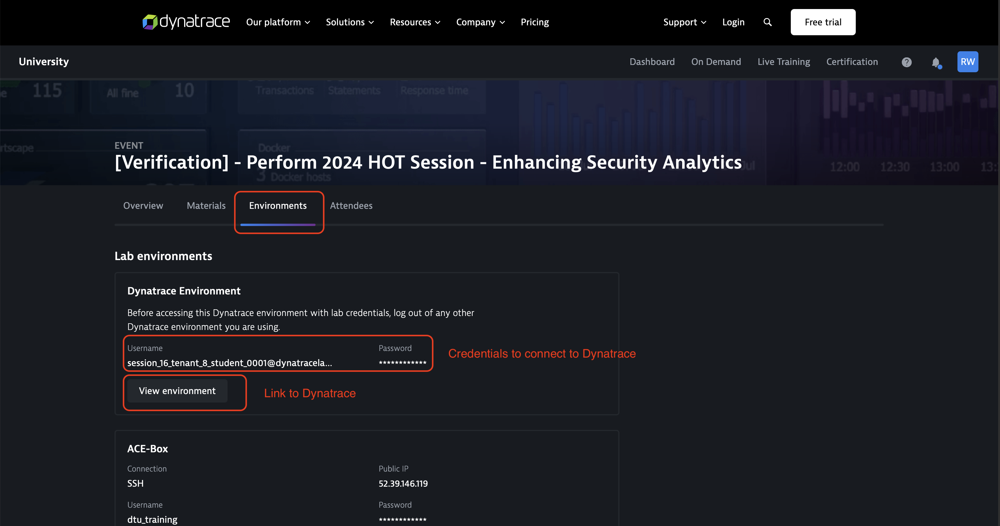
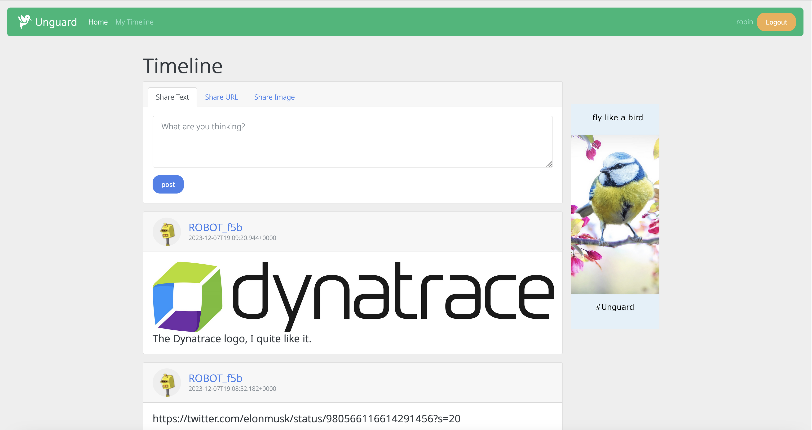

## Lab 0: Hello DQL
This first ab is to verify the access to the environment that will be used and do your first steps with Notebooks and DQL.

### Access Lab Environment
You can find the details about the environment in Dynatrace University on the Environment tab of the event. You will see a buton that brings you to the Dynatrace environment and right above that it shows you the crendentials to access Dynatrace.

### Unguard

We will us an application called unguard for this lab, it is an insecure cloud native microservices demo application. The application is a simple twitter clone, which allows to post messages, images and URLs. 

You can access it using the following URL: [http://unguard.dtulab716435646.dynatrace.training/ui/](http://unguard.dtulab716435646.dynatrace.training/ui/)

#### Notebook Template
You can find the instructions and the template for the lab in this notebook: 
[https://vis62283.sprint.apps.dynatracelabs.com/ui/document/v0/#share=c69b880e-fdfd-4f29-bbf8-0ca19ed6f8db](https://vis62283.sprint.apps.dynatracelabs.com/ui/document/v0/#share=c69b880e-fdfd-4f29-bbf8-0ca19ed6f8db)
> - The notebook is read-only, duplicate it to create your own copy which you can use to work on the exercises. 

#### Task 1: Create a new user
> - Open the unguard app using the link above
> - On the top right, click on *Login/Register*
>   - Choose a unsername and password 
>  - | ⚠️ the password is logged in clear text and will be visible to everyone
>  - Click on *Sign up* 
>- Now you should be able to login with your newly created user.

#### 2. Filter by username
The query above fetches all logs and returns the first 1000 values, but generally, we want to restrict the output to certain criteria by using the [filter command](https://docs.dynatrace.com/docs/shortlink/filtering-commands#filter).
> - Try to find the logs related to the user you just created
> - Hint: you can use the [contains function](https://docs.dynatrace.com/docs/shortlink/string-functions#contains) to search for text occurences

#### 3. Show only relevant fields in the result
By default, all fields are shown in an output, but most of the time we want to focus on specific information. Using the [fields command](https://docs.dynatrace.com/docs/shortlink/dql-commands-overview#selection-and-modification-commands).
> - Find out which process logged this information and the name of the Kubernetes cluster on which it is running.
>   - Hint: you can then use the *Options* to change the way the results are displayed"

#### 4. Find all new registered users
Since all participants registered a new user, you should be able to find this in the logs as well. But as you don't know the usernames they chose, you will need to find other criteria to filter by. Take a look at the content from the log above and try to find a criteria that allows you to filter out all logs for user registrations.
> - Query the logs to find all registration events
>   - Hint: Based on the result above, try to find a criteria that matches log entries about new user registrations.

#### 5. Exclude robots from the result
As you can see, there are a lot of robots that register new users, how can you remove them from the results?
> - Filter out all Robots to only see registrations by real users
>   - *Hint: take a look at the [filterOut command](https://docs.dynatrace.com/docs/shortlink/dql-commands-overview#filtering-commands)*"

#### 6. Count the number of new registrations
Now that we filtered the logs for entries about real users that registered, we can use DQL to count them.
> - Count the number of users that registered
>   - Hint: take a look at the [summarize command](https://docs.dynatrace.com/docs/shortlink/dql-commands-overview#aggregation-commands)
>   - Hint: you can change the way the result is displayed with the options menu

### Optional: Query spans
Since Grail stores more than just logs, we can use DQL to query other observability data like traces, events, metrics, etc.

Instead of using logs, we can find the details about the registered users in traces. Logs are dependent of the application, sometimes applications don't have the required information in their logs, but traces will always capture the information about the requests that were made. 

Let's see how we can find the information we queried above using traces. Traces consist of individual spans and we can use DQL query to use these spans with `fetch spans`

#### 8. Find registration requests
As you can see, that data is much more structured in spans than it is in logs. We have dedicated fields for the url, HTTP method, HTTP headers, etc.
> - Filter the spans using the url (*url.path*) and HTTP method (*http.request.method*) to find all POST request that were made to the register endpoint. 

#### 9. Filter out robots by user-agent
In the previous exercise, we were using the username to filter out the robots, that worked because they were always prefixed with ROBOT_. Instead of using the username, which relies on a pattern, we can use the user-agent, identifying the browser that was used to determine if it was a robot. 
> - We know that the robots have either *axios* or *simulated-browser-user* in their user-agent. Use those values to filter out requests by HTTP headers (*http.request.headers*)

#### 10. Query full trace\nIn the queries above, we were always looking at individual spans, but we can also take a look at full traces.
> - Hint: the trace.id is a Uid and needs to be converted first using [toUid](https://docs.dynatrace.com/docs/platform/grail/dynatrace-query-language/functions/conversion-and-casting-functions#toUid):  `trace.id == toUid(\"6c06857d74bbff7161fb8ae19aa5b6a5\")`
>   - Hint: to have the results in order, [sort](https://docs.dynatrace.com/docs/platform/grail/dynatrace-query-language/commands/ordering-commands#sort) the results descending by *start_time*"

For our investigations we can leverage the full Dynatrace Platform, meaning that we don't necessarily need to use DQL for everything, we can for example use the [Distributed Traces](https://sel18797.sprint.apps.dynatracelabs.com/ui/apps/dynatrace.classic.distributed.traces/ui/diagnostictools/purepaths?gtf=-2h&gf=all), [Service details](https://sel18797.sprint.apps.dynatracelabs.com/ui/apps/dynatrace.classic.services/#serviceOverview;id=SERVICE-3173BE5994AD5D2B;gf=all;gtf=-2h) or [Service Flow](https://sel18797.sprint.apps.dynatracelabs.com/ui/apps/dynatrace.classic.services/#serviceflow;sci=SERVICE-3173BE5994AD5D2B;timeframe=custom1706253814056to1706261014056;gtf=-2h;gf=all)

#### Lab 0 Recap
In this session we saw:
- How to fetch logs and filter by certain criteria using contains
- Restrict the fields to be displayed and sort the data
- Summarize the results to count the entries
- Use spans to see additional details
- Leverage the full Dynatrace Platform for investigation\n
