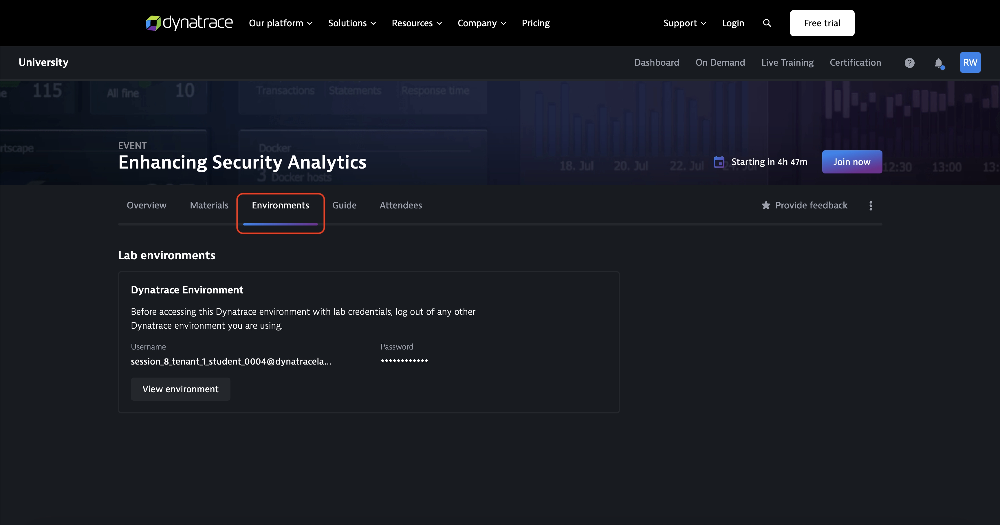

## Hello DQL
This first ab is to verify the access to the environment that will be used and do your first steps with Notebooks and DQL.

### Access Lab Environment
You can find the details about the environment in Dynatrace University on the Environment tab of the event. You will see a buton that brings you to the Dynatrace environment and right above that it shows you the crendentials to access Dynatrace.

Below that, you will the details to the Ace-Box which hosts the demo application that is used during the lab. We will only use the SSH access to retreive the URL of the unguard demo app and you can do this directly from you browser by clicking on the *Open Terminal* button. This open a terminal window in your browser and show the link to unguar 

### Unguard

The Ace-Box contains an application called unguard, it is an insecure cloud native microservices demo application. The application is a simple twitter clone, which allows to post messages, images and URLs. 

> #### Task 1: Create a new user
> - Open the unguard app from the Ace-Box as described above
> - On the top right, click on *Login/Register*
>   - Choose a unsername and password 
>   - Click on *Sign up* 

> #### Task 2: Find it in the logs
> - Go to Dynatrace and open the Notebook App
> - Create a new Notebook
>   - Click on the *+ Notebook* button to create a new notebook
> - Rename it to *Lab0* (click on title and select rename)
> - In the Notebook, create a new *Query Grail* selection
> - Write your first DQL query: `fetch logs`
> - Try to find the log entry for when your user was registered
> - Restrict the fields to only show what your interested in
> - What was the name of the process that logged this information? On which host is it running?
> - Can you find a list of all users that registered?
>   -  There might a lot of entries from Robots, can you filter them out?