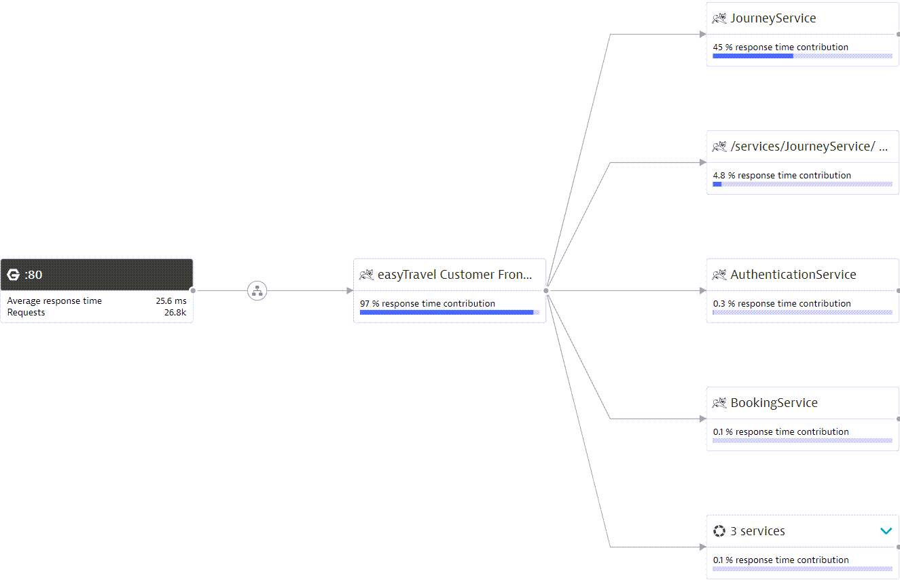
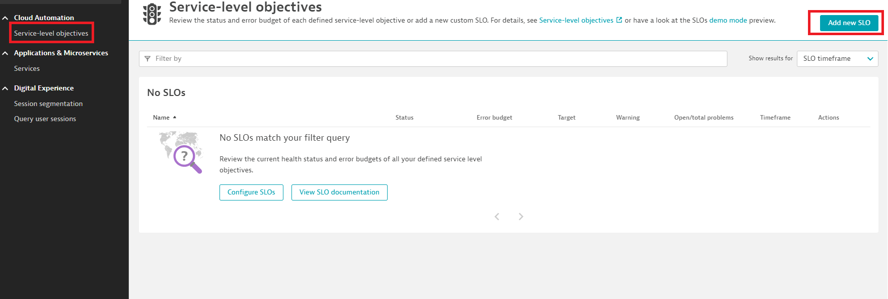
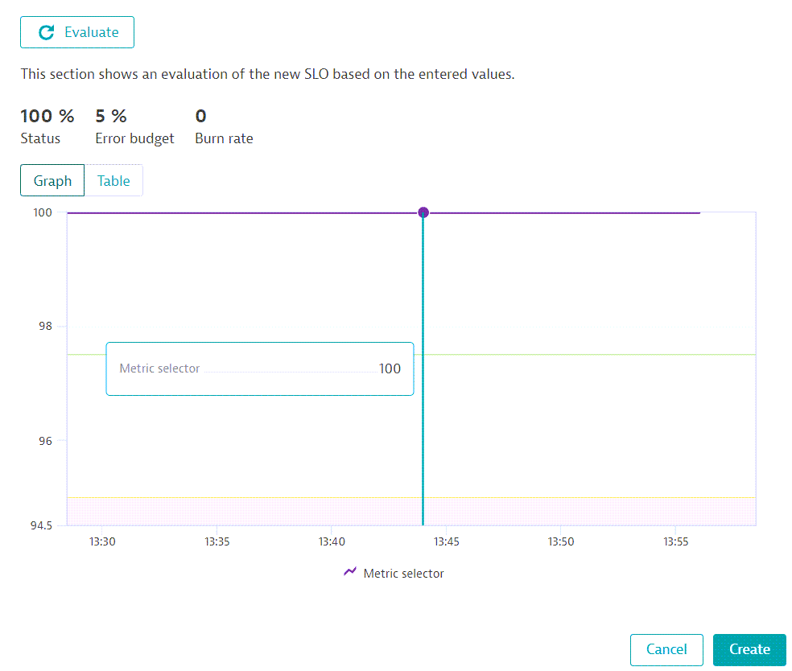

## Hands on #1 - Creating Your first SLO

#### Situation: You are a SRE tasked with defining and tracking a SLO for a new frontend service that has recently been introduced into the application.
<br/><br/>

### We'll utilize the *7-steps SLO Framework* to establish an effective SLO for understanding realiability of application.


1. In a new browser tab, open the Easytravel App. Perform a couple interactions.
> - Easytravel URL can be found in the *DTU event > EKS Bastion Host > Open Terminal*. Should look like - http://easytravel.dtulabID.dynatrace.training/</br>
> - Identify the type of customer groups *Frontend Service* services. </br>
> #### *Step 2 of SLO Framework*

2. In a new browser tab, navigate to Dynatrace environment and access *Services*. 


3. Navigate to the nginx service *:80*, then click on *View Service Flow*. 
> - This is the transaction flow processed by the *Frontend Service* </br>
> - We'll use this to identify services. </br>
> #### *Step 3 & 4 of the SLO Framework*



4. Next, Navigate back to the Easytravel App, and focus on the *Your Journey* Feature.
> - Key function of application. </br>
> #### *Step 5 of the SLO Framework* </br>
> - Apply the following statements to the *Your Journey* feature: 

```
Availability – Is the service there when customers need it?
Correctness – Does the service function as intended?
Performance – Is the service stable, fast and able to meet demand?
```


> - This will help identify our focused indicator.

5. Next, Navigate back to Dynatrace environment and access Service-level Objectives.
7. Click on add new SLO



> - We’ve now entered the Dynatrace SLO configuration wizard.

8. Provide a meaningful name/metric for the SLO. *{ENV}_{APP NAME}_{HoT#}_{ENTITY TYPE}_{TYPE}*

```
SLO Name : Prod - Easytravel - HoT1 - Service - Availability
SLO Metric : prod_easytravel_hot1_service_availability
```

9. Click on *Service-level Availability* Dynatrace will fill the metric expression with a templated SLI. You should see a string similar to this:
> #### *Step 6 of the SLO Framework*

```
(100)*(builtin:service.errors.server.successCount:splitBy())/(builtin:service.requestCount.server:splitBy())
```


10. Next, let's set the filters for the SLO.
> - Time Frame - the evaluation period of SLO. *last 30 minutes* </br>
> - Entity Selector - the entities from where SLI is calculated. *JourneyService*</br>
> #### *Step 7 of the SLO Framework* </br>

```
timeFrame : -30m
entitySelector : type("SERVICE"),entityName.equals("JourneyService")
```


11. Next, let's set our SLO target.
> #### *Step 7 of the SLO Framework* </br>

```
Target - 95.0
Warning - 97.5
```


13. Finally, preview the SLO and hit 'Create'



14. Navigate to *Dashboards* and identify the following dashboard : *Perform 2023 HoT*

15. Edit the SLO tile of the current Hands-On, and select the SLO we just created: *Prod - Easytravel - HoT1 - Service - Availability*


#### Congratulations!, you've completed creating your first SLO. We applied the 7-Step SLO Framework to create an effective SLO.