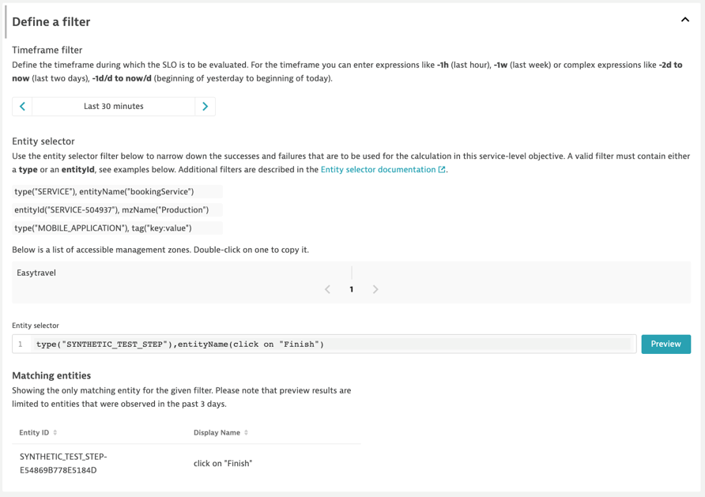
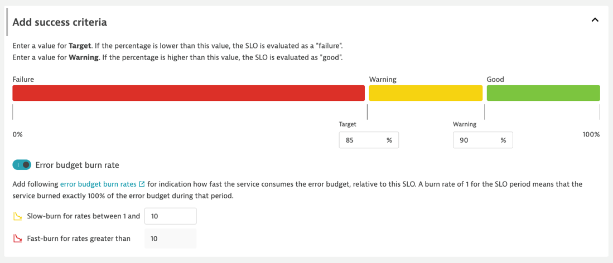

## Hands on #6 - Advanced SLO - Synthetic

#### You are investigating an issue with a third-party payment provider. To track the current state, you create a test transaction (click path) to monitor the checkout process. Based on the transaction, you define an SLO proving the performance of the checkout page, invoking the third-party payment provider.

1. Navigate to the Service-level Objectives page and add a new SLO. 


2. Provide a meaningful name/metric/description for the SLO. *{ENV}\_{APP NAME}\_{HoT#}\_{ENTITY TYPE}\_{TYPE}*

SLO Name : 
```
Prod - Easytravel - HoT6 - Synthetic - Performance
```

SLO description:
```
85% of checkouts complete in <= 2 seconds
```

SLO Metric : 
```
prod_easytravel_hot6_synthetic_performance
```

3. Set the Metric Selector
> Goal - measure the performance of the checkout page of, where checkouts take less than or equal to 2 seconds. </br>
> - SLI = synthetic event action duration paritioned with *good* results <= 2000ms or (2 sec).

```
(builtin:synthetic.browser.event.actionDuration.load:avg:partition("latency",value("good",lt(2000))):splitBy():count:default(0))/(builtin:synthetic.browser.event.actionDuration.load:avg:splitBy():count:default(0))*(100)
```


4. Next, let's set the filters for the SLO.
> - Time Frame - the evaluation period of SLO.</br>
> - Entity Selector - the entities from where SLI is calculated. </br>


timeFrame : 
```
-30m
```

entitySelector : 
```
type("SYNTHETIC_TEST_STEP"),entityName(click on "Finish")
```



5. Next, let's set our SLO target.

Target - 
```
85.0
```

Warning - 
```
90.0
```



6. Finally, preview the SLO and hit 'Create'

7. Navigate to *Dashboards* and identify the following dashboard : *Perform 2023 HoT*

8. Edit the SLO tile of the current Hands-On, and select the SLO we just created: *Prod - Easytravel - HoT6 - Synthetic - Performance*

