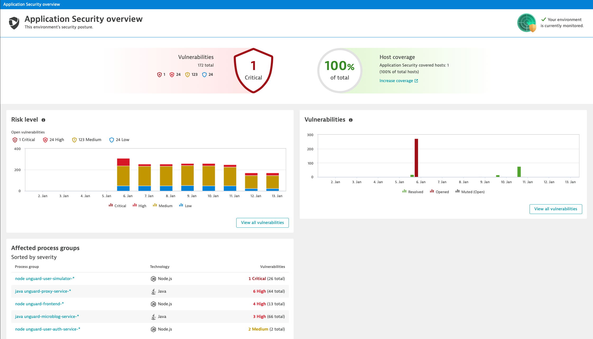
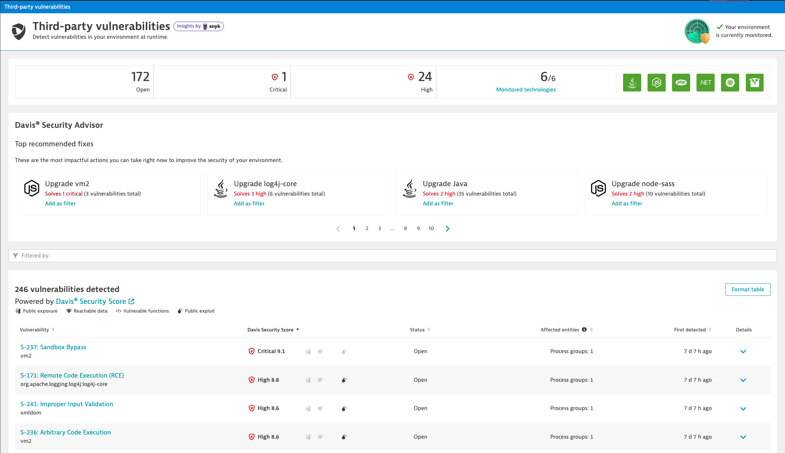
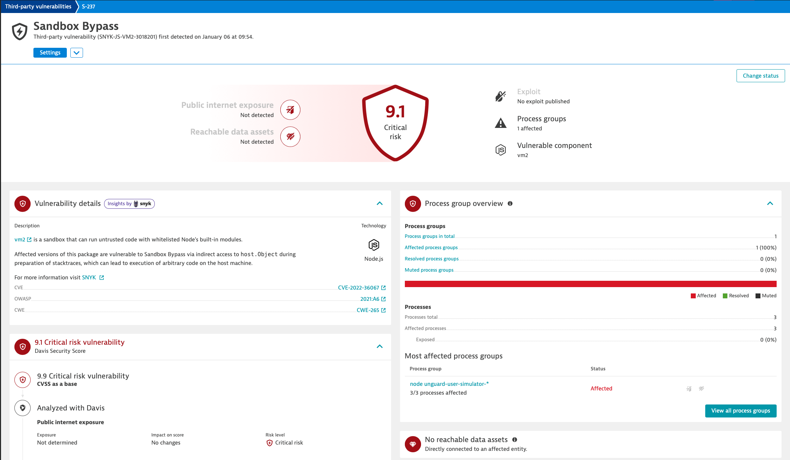
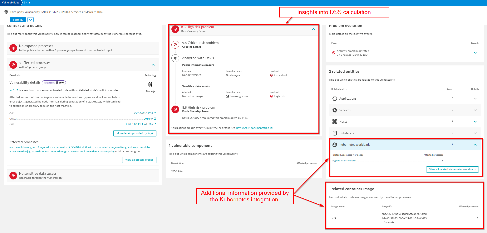
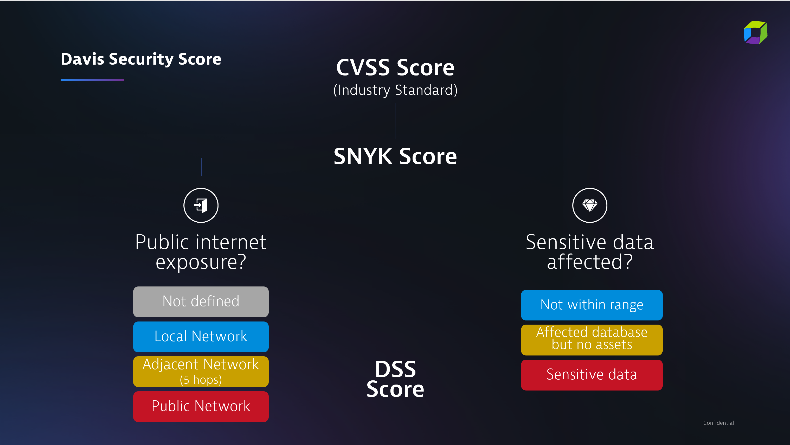
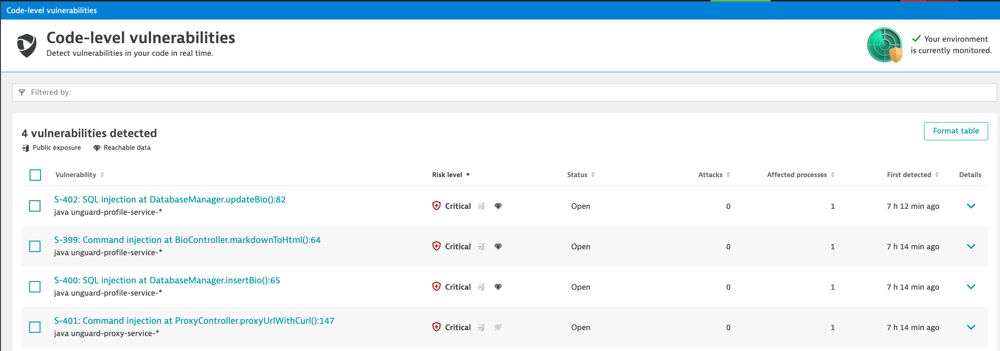
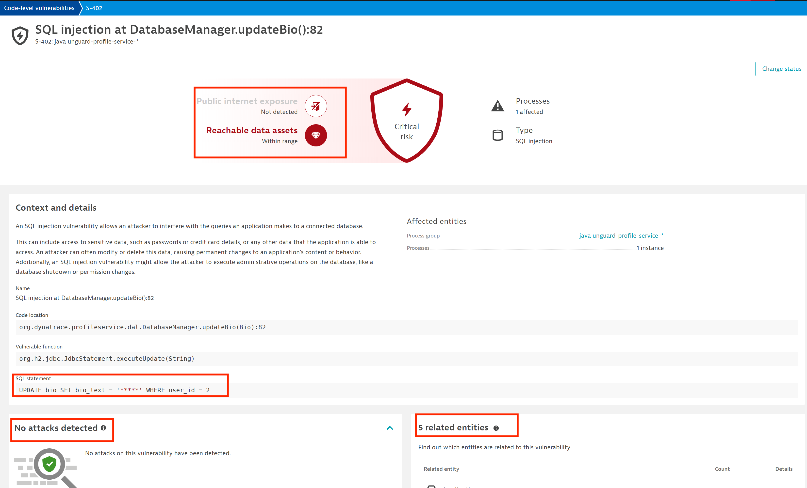

## Getting Familiar with AppSec
### Security Overview

Go to your Dynatrace instance and navigate to `Application Security` > `Security Overview`.



Explore what is displayed ont the screen:
1. How many vulnerabilities were discovered?
2. How many of each category?

> Since we just activated it, the evolution over the past 30 days doesn't show much. 

Click on **View all vulnerabilities**.

### Vulnerabilities
On this screen you can see a list of all vulnerabilities that were discovered in the environment. 



Take a look at the list, try out the different filters, take a look at the findings from the Davis Security Advisor.

**Exercise**
This environment affected by the vulnerability with CVE ID `CVE-2021-44228`. Find it an open it. Do you recognize it?


### Vulnerability details


Here you can find all the details about the selected vulnerabilty.



On the left side under `Context and details` you can see which processes are affected and get more details about the vulnerability. Using the links you can navigate to NVD, CWE, OWASP or Snyk to read more about it. 

**Exercise**
1. With the information in the `Context and details`, find out how to remediate the vulnerability.

With `View all process groups` you get to the Remediation Tracking screen, that shows details about the affected process groups. 

At the bottom you can see the related entities and container images. You can see this information because our monaco pipeline added the Kubernetes credentials needed to integrate Dynatrace with the Kubernetes API.



**Exercise**
1. What is the version of the affected library?
2. On which hosts are the affected processes running?


## Davis Security Score

### DSS Recap

Davis Security Score (DSS) is an enhanced risk-calculation score based on the industry-standard Common Vulnerability Scoring System (CVSS). Because Davis AI also considers parameters like public internet exposure and checks to see if and where sensitive data is affected, DSS is the most precise risk-assessment score available.
The OneAgent knows and reflects that in the Davis Security Score.




## Code Level Vulnerability Analytics

Until now we focused on known vulnerabilities within open source third party components. We now turn to unknown vulnerabilities in the code due to not following secure coding best practices.

Dynatrace can find SQL injection (SQLi), command injection (CMDi), and JNDI vulnerabilites in java-based running code before an attacker can exploit them in an attack.  Dynatrace does this by evaluating data flows through the applications. Any user generated input is tracked from the web/API request to a vulnerability-type specific function call (database requests for SQLi and command requests for CMDi). If Dynatrace sees that this user input *isn't* sanitized prior to hitting a vulnerable function, then a code-level vulnerability will be logged with all of the context to aid in prioritization that we saw in the previous section. This contextualy prioritized data can then be fed back into remediation workflows to application development teams.


### Verify access to CLV
If the user generated input is directly used in the vulnerability-type specific function call, then a code-level vulnerability will be created. No malicious attacks are necessary any more to identify these vulnerabilities.
Vulnerability assessment, as well as context and detailed information are shown similar to third-party vulnerabilities.

In the Dynatrace menu, go to the `Code-level vulnerabiities` section under the `Application Security` menu to view any detected code-level vulnerabilities.

 

 ### View Code-level Vulnerability

Within the code-level vulnerability dashboard, open the vulnerability called ```Improper input validation at JndiManager.lookup():128```.  

<details open>
  <summary>Do you recognize this vulnerability? </summary>
  It's log4j again!
</details>

As explained in the introduction, log4j is a JDNI injection vulnerability, which is detected as code level vulnerability by Dynatrace. 
In addition to providing context around usage (related entities and reachable data assets etc), Dynatrace will also identify if this unknown vulnerabilty was part of an active attack identified by RAP.  We will be discussing RAP in the next section.

One more important thing to note, is that data privacy rules and settings apply to code-level vulnerabilities and the associated user input captured.


