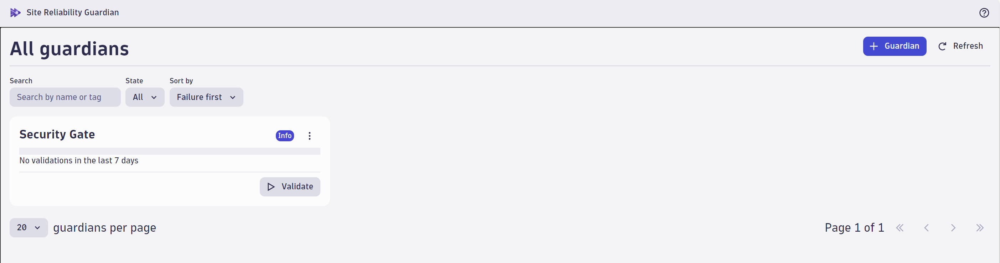
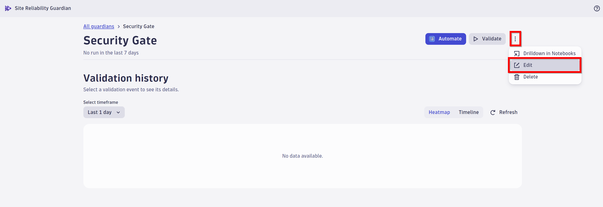
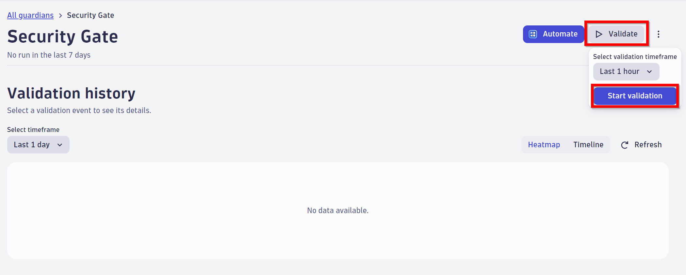

##  Security Gates
During this lab we will cover a very important aspect of securing applications against known third party vulnerabilities: detecting and stopping these vulnerabilities earlier in the SDLC and building an automated security gate from stopping vulnerabilities from being promoted to production.

### Intro

As Dynatrace AppSec detects new vulnerabilities in our application, we want to leverage that information to automatically stop a build from being promoted to the next stage.

For that, we will leverage **Site Reliability Guardian (SRG)** app that will allow us to define Service Level Objectives around any characteristic of our application's behavior, including Third Party Vulnerabilities, and leverage the outcome of those objectives to drive automation workflows.


### Hands-on: Site Reliability Guardian
Navigate to the ```Site reliability guardian``` app. 



In the SRG, open the guardian. We want to add the last query of our notebook as an SLI to our guardian.



```sql
fetch events
| filter event.provider=="Dynatrace"
| filter event.kind=="SECURITY_EVENT"
| filter event.type=="VULNERABILITY_STATUS_CHANGE_EVENT"
| filter event.level=="VULNERABILITY"
| filter event.status=="OPEN"
| filter in(vulnerability.risk.level,{"CRITICAL","HIGH"})
| makeTimeseries count()
```

#### Run validation manually
As a first step, we want to understand what a guardian does. It evaluates your KPIs/SLIs for a given timeframe. 




Let's analyze the result.

The power of the SRG comes from automatically evaluating your SLIs to give automated feedback to an event like a load test, a functional test or a new release.  So as a next step, we want to automated the validation.


#### Automate validation

On the guardian page, navigate to the ```navigate```button on the top right of the page. 
