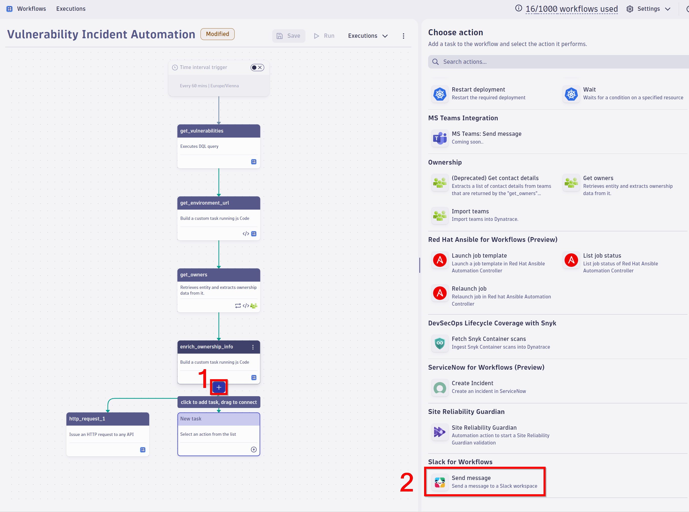

## Automating Security Incident Response With Workflows

Having seen a great use case of Dynatrace automation, we want to look into another great automation use case for application security: incident response. 

### Intro
Dynatrace workflows are designed to streamline the monitoring, management, security, and troubleshooting of applications, addressing the limitations of manual processes. Workflows offer a range of functionalities: graphical workflows for intuitive interface interaction, targeted actions for specific 3rd party tooling, specific event triggers that activate when problems are identified, and customized schedules to fit organizational needs. 

Let's look into workflows power when it comes to incident response.

### Open already configured workflow

In the workflow menu, open the `Vulnerability Incident Automation` workflow.  

### Notification



### Run Workflow

```
------------------------------

* <{{ result("get_environment_url") }}ui/apps/dynatrace.classic.technologies/#processgroupdetails;gtf=-2h;gf=all;id={{ result("enrich_ownership_info")["no_owners"][i]["affected_entity"] }};appswitched=true| {{ result("enrich_ownership_info")["no_owners"][i]["entity.name"] }}> 
Related to {{ result("enrich_ownership_info")["no_owners"][i]["vulnerabilities"]|length }} new HIGH and CRITICAL vulnerabilities:

-------------------------------
```
