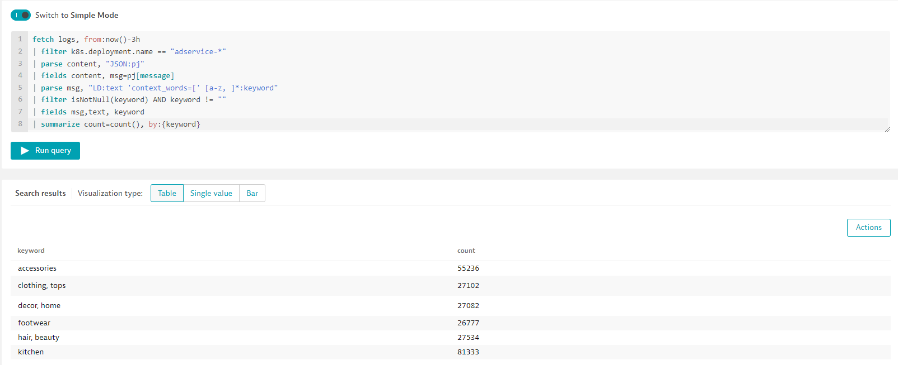

# Using built-in functions of DQL

This lab is designed to review a few hands-on examples of the most common built-in functions of DQL. After building some of these queries we will pin them to a dashboard for future reference.

For a full list of all the available functions check out our [help documents](https://www.dynatrace.com/support/help/how-to-use-dynatrace/log-and-event-processing/log-and-event-processing-functions)


## JSON Parsing
It is a common occurance that you will need to parse a log event that is formated in JSON.  The DQL parse function contains a very convenient to accomplish this to achieve the output to you looking for.

Step 1. Let's get some data to start
```
fetch logs, from:now()-3h
| filter k8s.deployment.name == "adservice-*"
```
You will see in the ouput that the `content` field the output is JSON that looks like this:

```
{
  "instant": {
    "epochSecond": 1670595859,
    "nanoOfSecond": 940042000
  },
  "thread": "unleash-api-executor",
  "level": "INFO",
  "loggerName": "hipstershop.AdService",
  "message": "Fetched toggles. Status: NOT_CHANGED",
  "endOfBatch": false,
  "loggerFqcn": "org.apache.logging.log4j.spi.AbstractLogger",
  "threadId": 46,
  "threadPriority": 5,
  "logging.googleapis.com/trace": "00000000000000000000000000000000",
  "logging.googleapis.com/spanId": "0000000000000000",
  "logging.googleapis.com/traceSampled": "false",
  "time": "2022-12-09T14:24:19.940Z"
}
```

Step 2. Parse the JSON

Now we need to parse the JSON using the `parse` command and the `JSON` output
```
fetch logs, from:now()-3h
| filter contains(dt.process.name, "adservice")
| parse content, "JSON:pj"
```
This will now extract the content field and create a new field called `pj` with the JSON output

Let's take this one step further by only extracting the `message` field in the JSON

```
fetch logs, from:now()-3h
| filter k8s.deployment.name == "adservice-*"
| parse content, "JSON:pj"
| fields content, msg=pj[message]
```
This will now give us message attributes with the categories we care about, for example:
```
received ad request (context_words=[clothing, tops])
```

Step 3. Parse the message field

Now we just need to extract the categories from the message.  We can do this by using the `parse` command again, along with a little regex.

```
fetch logs, from:now()-3h
| filter k8s.deployment.name == "adservice-*"
| parse content, "JSON:pj"
| fields content, msg=pj[message]
| parse msg, "LD:text 'context_words=[' [a-z, ]*:keyword"
```

This should now create seperate fields for the `text` and the `keyword`

Step 4. Clean up and Summarize
The final thing we want to do is remove some of the `null` and blank values and then do a summary on the different keywords.

First the filter:
```
fetch logs, from:now()-3h
| filter k8s.deployment.name == "adservice-*"
| parse content, "JSON:pj"
| fields content, msg=pj[message]
| parse msg, "LD:text 'context_words=[' [a-z, ]*:keyword"
| filter isNotNull(keyword) AND keyword != ""
| fields msg,text, keyword
```

And now the summary
```
fetch logs, from:now()-3h
| filter k8s.deployment.name == "adservice-*"
| parse content, "JSON:pj"
| fields content, msg=pj[message]
| parse msg, "LD:text 'context_words=[' [a-z, ]*:keyword"
| filter isNotNull(keyword) AND keyword != ""
| fields msg,text, keyword
| summarize count=count(), by:{keyword}
```

## Conversion Functions

Conversion functions are used to convert one data type to another type (ex. Integer to String)

### **Example 1 - Arrays**

In this example we'll convert a list of numbers and a list of strings into an array.

First let's create some data:
```
fetch logs
| fields var_value = 235711131719, num_array = array(2, 3, 5, 7, 11, 13, 17, 19, 23, 29, 2, 3, 5, 7, 11)
```

Now lets turn each into an array, but using the `toArray` function
```
fetch logs //, scanLimitGBytes: 500, samplingRatio: 1000
| fields var_value = 235711131719, num_array = array(2, 3, 5, 7, 11, 13, 17, 19, 23, 29, 2, 3, 5, 7, 11)
| fields toArray(num_array), toArray(var_value)
```

And for tidiness, let's limit the results to 1 record
```
fetch logs //, scanLimitGBytes: 500, samplingRatio: 1000
| fields var_value = 235711131719, num_array = array(2, 3, 5, 7, 11, 13, 17, 19, 23, 29, 2, 3, 5, 7, 11)
| fields toArray(num_array), toArray(var_value)
| limit 1
```

### **Example 2 - Booleans**


## Time Functions

## Other Functions