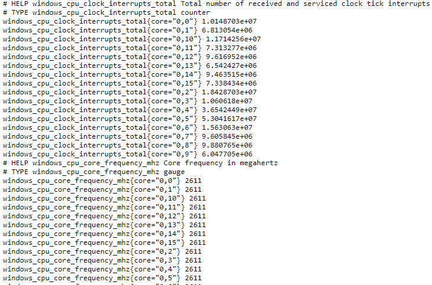
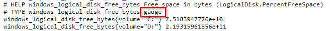
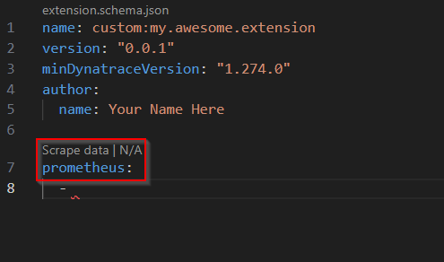
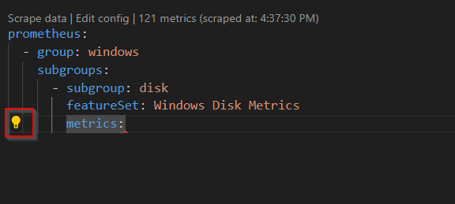

## Data source and scope

In this example we are collecting data from a Windows exporter which is currently running on your Windows environment.

You can verify this is available locally on you lab host by accessing: `http://localhost:9182/metrics`




Let's go through an example of the datasource and discuss new concepts:

```yaml
prometheus:
  - group: windows
    subgroups:
      # Additional subgroups defined
      - subgroup: disk
        featureSet: Windows Disk Metrics
        dimensions:
          - key: volume
            value: label:volume
            filter: var:volume
        metrics:
          - key: windows_logical_disk_free_bytes
            value: metric:windows_logical_disk_free_bytes
            type: gauge
          # Additional metrics defined
```

Let's break it down...

* In this set of System metrics, we are creating a subgroup to collect metrics about **Logical disks**

* The next dimension will grab the **volume** label from the metric line `windows_logical_disk_free_bytes` and assign it to a key called **volume**
    * For example, our Windows exporter line says:

    `windows_logical_disk_free_bytes{volume="C:"} 4.4214255616e+10`
    
    It will grab the volume label "C:" and assign it a new volume dimension

    * Note that adding dimensions manually is not required for Prometheus as all labels will be included as dimensions automatically. You should only need to include dimensions explicitly if you want to perform filtering on one.

```yaml
        dimensions:
          - key: volume
            value: label:volume
```

* Next we map our metric key to the metric name from our windows exporter

* Every metric in our exporter has a **TYPE**, make sure to use the appropriate type (count or gauge). If you do not use the appropriate type, **your metric could result in not displaying or 0 value**



```yaml
        metrics:
          - key: windows_logical_disk_free_bytes
            value: metric:windows_logical_disk_free_bytes
            type: gauge
          - key: windows_logical_disk_size_bytes
            value: metric:windows_logical_disk_size_bytes
            type: gauge
```

### VS Code Prometheus Code Lens

When you define the Prometheus data source in an active extension workspace the Prometheus lens will automatically appear. Using 'Scrape data' will let you point to a Prometheus metrics endpoint and have it's data collected to assist you in defining your metric collection.



For our lab, you'll opt to use a 'URL' and then point it at our Windows Prometheus metrics endpoint with no authentication:

`http://localhost:9182/metrics`

Create a `disk` subgroup.

After a successful scrape you'll see a lightbulb icon when defining the `metrics` section that will allow you to automatically insert those metrics. Select a few metrics appropriate for a disk subgroup such as `windows_logical_disk_free_bytes` and `windows_logical_disk_size_bytes`



After this step your extension should look like this:

```yaml
name: custom:windows-prometheus
version: "0.0.1"
minDynatraceVersion: "1.280.0"
author:
  name: Alice Smith

prometheus:
  - group: windows
    subgroups:
      - subgroup: disk
        metrics:
          - key: windows_logical_disk_free_bytes
            value: metric:windows_logical_disk_free_bytes
            type: gauge
          - key: windows_logical_disk_size_bytes
            value: metric:windows_logical_disk_size_bytes
            type: gauge
```