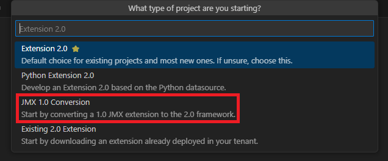

## Data source and scope

In this example we are converting a 1.0 JMX extension for Kafka to the 2.0 framework.

### Conversion

1.0 JMX extensions were defined in a json file (`plugin.json`). In the 2.0 framework we will need to convert this to the `extension.yaml` we are familiar with.

Start by opening a new empty folder in VS code for the 2.0 Extension.

Then use the 'Initialize workspace' command and select the latest schema version and to use existing certs. Using existing certs means we are re-using the certificates from the earlier labs and do not need to upload them to Dynatrace or distribute them to our hosts and ActiveGates.

When asked what type of project you are creating select "JMX 1.0 Conversion." It will ask if you have this extenion file locally or would like to retrieve it from your connected Dynatrace environment. The 1.0 extension you will use can be found [in the supporting materials under jmx\\1.0](../../../../supporting-materials/jmx/1.0/plugin.json). Use the local option and select the plugin.json file.



Finally, select "yes" when asked if you would like to show this JMX data on the Host details page.

You should now see your `extension.yaml` filled with:
  - The JMX definition describing what attributes and properties to collect from which Mbeans
  - Screen definitions that 'inject' this JMX data into the appropriate process group instances and hosts
  - Metric metadata giving these metrics display names, units, and other metadata

All of this was extracted from the 1.0 json file and converted to the equivalent 2.0 yaml file. Note that this was not simply converting json to yaml as the structure of the 2 files are very different.

First, let's take a look at the most important part; the JMX section that defines what this extension will collect from which Mbeans.

```yaml
jmx:
  groups:
    - group: jmx
      subgroups:
        - subgroup: kafka.server:type=BrokerTopicMetrics,name=BytesInPerSec
          query: kafka.server:type=BrokerTopicMetrics,name=BytesInPerSec
          metrics:
            - key: tech.kafka.kafka.server.BrokerTopicMetrics.BytesInPerSec.OneMinuteRate
              value: attribute:OneMinuteRate
              type: gauge
  # ...
    - subgroup: kafka.producer:type=producer-metrics,client-id=*,*
          query: kafka.producer:type=producer-metrics,client-id=*,*
          metrics:
            - key: tech.kafka.kafka.producer.producer-metrics.request-rate
              value: attribute:request-rate
              type: gauge
            - key: tech.kafka.kafka.producer.producer-metrics.request-size-avg
              value: attribute:request-size-avg
              type: gauge
            - key: tech.kafka.kafka.producer.producer-metrics.incoming-byte-rate
              value: attribute:incoming-byte-rate
              type: gauge
            - key: tech.kafka.kafka.producer.producer-metrics.outgoing-byte-rate
              value: attribute:outgoing-byte-rate
              type: gauge
```

Let's break it down...

Each **subgroup** will be one JMX query. Multiple Mbeans can match and wildcards (`*`) can be used for properties in scenarios such as when you are reporting metrics for several queues or clients.

You can also define `dimensions` and `metrics` to collect from this query. These can use properties (`property:`) and attributes (`attribute:`). Properties are what you would see in the query.

Take some time to look through the various other sections of the yaml file. The screens section in particular will make use of some advanced concepts to display data very similarly to how it was presented in 1.0 extensions.

Finally, build, deploy, activate the extension in your environment and take a look at the collected data after a few minutes.