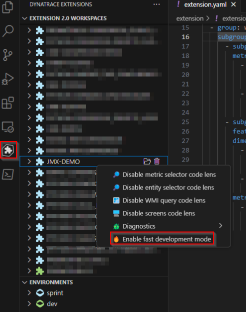
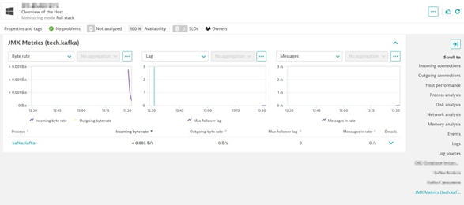

## Customizing the UI

The conversion process takes care of all of the heavy lifting and complexity of converting a 1.0 JMX extension to the new framework but you still may be interested in making a few customizations. You may also be simply interested in how some of it works so that you can make any additional JMX extension you create from scratch even better.

You'll find the charts and other cards display on the entity screens defined in the **screens** section with an entry for each entity type.

Locate the automatically created `JMX Metrics (tech.kafka)` metric table definition (on the host page) and make a few small changes:
- Give it a different display name
- Adjust the number of charts displayed

To speed things up you can activate "Fast development mode" for this extension workspace. This will cause a build, deploy, and activation to occur on every save to your extension.yaml file. This will not update your monitoring configurations, just the 'active' rules in the environment such as the UI screen definitions making it ideal for getting fast feedback on changes you're making to UI components.

To activate fast development mode locate this workspace in the VS Code Add On, right click, and select "Enable fast development mode."

Build and activate your extension then observe the resulting changes.