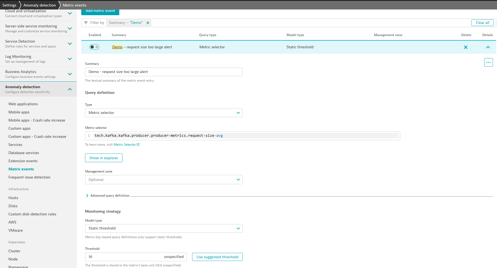

## Including alerts
You do not *need* to include metric alerts within your extension but doing so can save time and help with standardization if you have a custom extension that you'll be deploying to multiple environments.

If this is not needed you can always define metric events for alerting within your environment the same way you would for any non-extension metrics.

The VS Code add-on makes including alerts easy.

### Generate the alert

Use the `Create alert` command to start the workflow.

1. Select a metric key for the alert
2. Give your alert a meaningful name
3. Select if the values ABOVE or BELOW your threshold should trigger alerts
5. Enter the threshold

From here 2 things will have happened:
1. A json file was generated under the `alerts` subdirectory with the details you configured
2. A reference to this alert json was included within the **alerts** section of the extension

```json
{
  "id": "6786d165-f7e2-4197-be16-fd0684d90a5d",
  "metricSelector": "tech.kafka.kafka.producer.producer-metrics.request-size-avg",
  "name": "Demo - request size too large alert",
  "description": "The {metricname} value was {alert_condition} normal behavior. Dimensions: {dims}",
  "enabled": true,
  "monitoringStrategy": {
    "type": "STATIC_THRESHOLD",
    "violatingSamples": 3,
    "samples": 5,
    "dealertingSamples": 5,
    "alertCondition": "ABOVE",
    "alertingOnMissingData": false,
    "threshold": 10
  },
  "primaryDimensionKey": "dt.entity.process_group_instance",
  "alertCondition": "ABOVE",
  "samples": 5,
  "violatingSamples": 3,
  "dealertingSamples": 5,
  "threshold": 10,
  "eventType": "CUSTOM_ALERT"
}
```

```yaml
alerts:
  - path: alerts/alert-001-demo-request-size-too-large-alert.json
```

Now build and activate your extension. If you look within the Settings > Metric events for alerting in your environment you'll find your configured alert.


