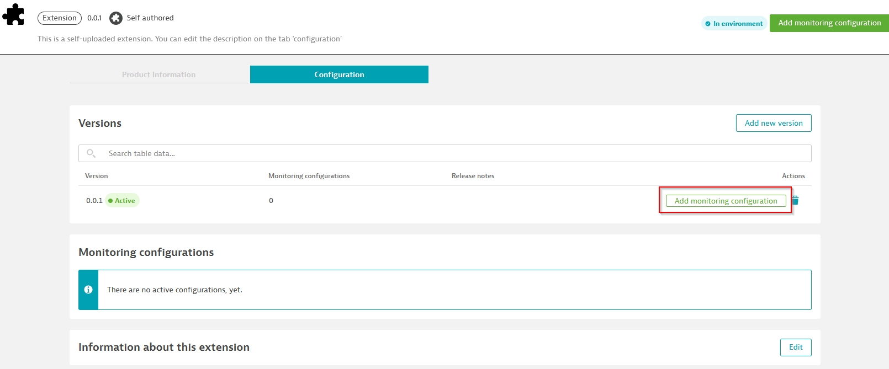
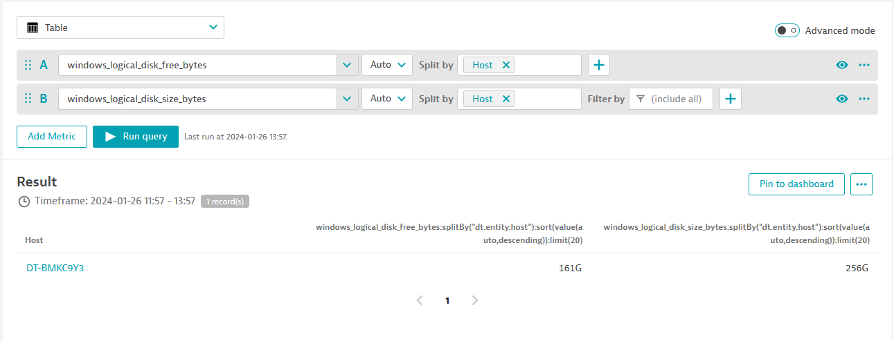

## Building your extension

Inside VS Code open a new windows and select to open the `prometheus-demo-extension` folder. Then open up the command palette (ctrl + shift + p) and search for "Dynatrace" and choose the `Dynatrace: Build Extension` option. 

This will sign and package your extension into a zip file called custom_prometheus.demo-1.0.0.zip

The Dynatrace Extension Copilot will then offer you to upload and activate this new version of the extension. 

Inside the Dynatrace UI -> Dynatrace Hub -> Manage & upload extensions -> custom:prometheus.demo -> Add a monitoring configuration

Select your host. This will automatically make it a `LOCAL` extension and click `Next`.

Add a new Prometheus endpoint and point it to `http://localhost:9182/metrics`. This prompt came from the **prometheus** data source we entered in the yaml file.

**Note: If you see a slash at the end '/', remove it**

Leaving a slash at the end will make the Prometheus data source try to collect data from a Prometheus API and not scraping a metrics endpoint

Next, select which Feature sets you want to enable, then Activate

We can see and verify data by going to **Data Explorer**, **Metrics**, or the **HOST** that the extension was deployed to in Dynatrace

We are done!