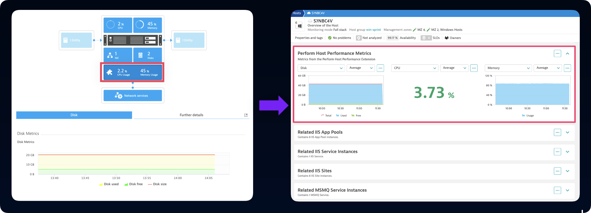
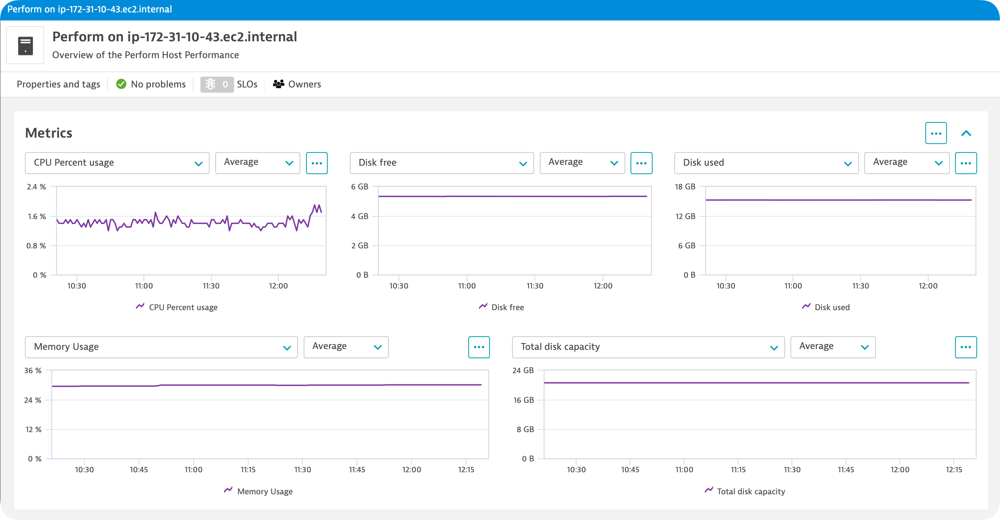
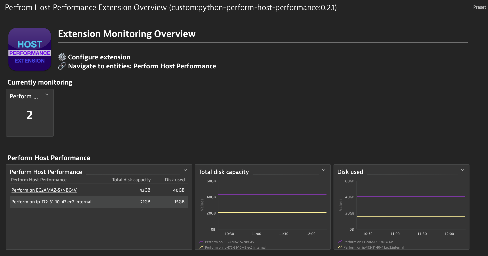

## Data source and scope

In this example we are converting a 1.0 Python extension to the 2.0 framework.

### Conversion Overview

Python extensions in the v1 framework are defined in the `plugin.json` and Python class file. In the 2.0 framework, we will need to move the data in these files to dedicated files that focus on different aspects of the extension. 

This task requires three main steps:

1. Converting the `plugin.json` file.
2. Converting the Python code.
3. Taking advantage of Extension 2.0 features.

### Where is extension data presented in the UI?

In version 1, the UI presented extension data either in the infographic of the host or process that the extension was attached to or as a Custom Device in the Technologies and Processes screen. Metric data could be explored in the Data Explorer, presented on a dashboard and alerted on using Metric Events. 

In version 2, the primary presentation of data takes place on Unified Analysis screens. Once a type has been defined in the extension topology, each extension will have it's own dedicated Unified Analysis screen. As the extension developer, you have the choice to also present your data as a card injected onto a Host or Process screen.

Using metrics provided by the extension, Dashboards can be created and bundled with the Extension to provide and overview of the data collected.

As always, metrics are available in the Data Explorer and ready to be used as the basis for alerting via Metric Events.

