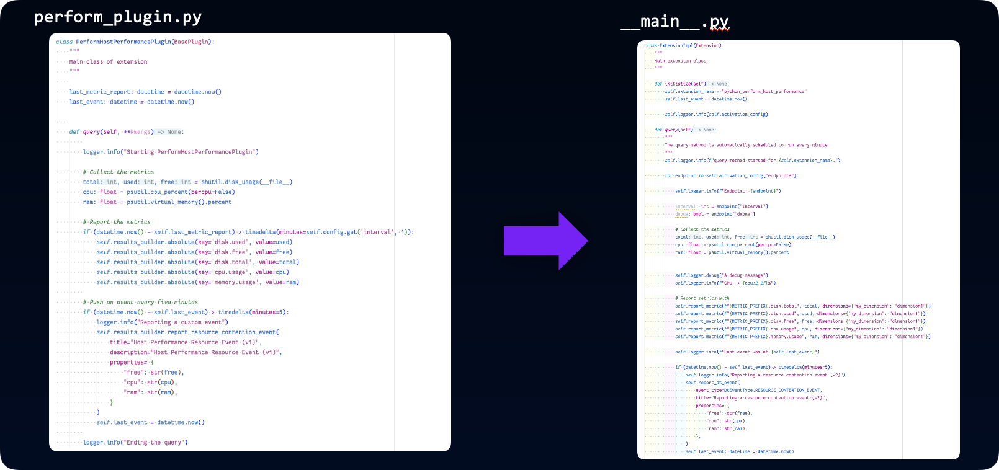
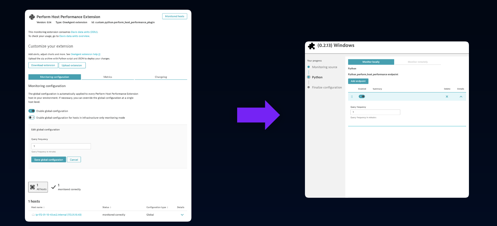

## Perform Host Performance Extension

All supporting materials are available [here](https://github.com/tukanuk/supporting-materials/tree/main).

The Host Performance extension collects basic host metrics using the `psutil` library. The extension collection 5 basic metrics and reports a resource contention event. 



Configuration of the extension is limited to a single property. End users can select the metric query interval.



#### plugin.json

Also available in the Resources folder.
Download [here](https://github.com/tukanuk/supporting-materials/blob/main/python/v1/plugin.json)

```json
{
    "name": "custom.python.perform_host_performance_plugin",
    "version": "0.14",
    "type": "python",
    "requiredAgentVersion": "1.268",
    "entity": "HOST",
    "metricGroup": "perform_host_performance.demo",
    "technologies": [
      "PYTHON"
    ],
    "source": {
      "package": "perform_plugin",
      "className": "PerformHostPerformancePlugin",
      "install_requires": [
        "psutil>=5.9.6"
      ],
      "activation": "Singleton"
    },
    "configUI": {
      "displayName": "Perform Host Performance Extension",
      "properties": [
        {
          "key": "interval",
          "displayName": "Query frequency",
          "displayOrder": 1,
          "displayHint": "Query frequency in minutes"
        }
      ]
    },
    "metrics": [
      {
        "timeseries": {
          "key": "disk.total",
          "unit": "Byte",
          "displayname": "Disk size"
        }
      },
      {
        "timeseries": {
          "key": "disk.used",
          "unit": "Byte",
          "displayname": "Disk used"
        }
      },
      {
        "timeseries": {
          "key": "disk.free",
          "unit": "Byte",
          "displayname": "Disk free"
        }
      },
      {
        "timeseries": {
          "key": "cpu.usage",
          "unit": "Percent",
          "displayname": "CPU Usage"
        }
      },
      {
        "timeseries": {
          "key": "memory.usage",
          "unit": "Percent",
          "displayname": "Memory Usage"
        }
      }
    ],
    "ui": {
      "keymetrics": [
        {
          "key": "cpu.usage",
          "aggregation": "avg",
          "displayname": "CPU Usage"
        },
        {
          "key": "memory.usage",
          "aggregation": "avg",
          "displayname": "Memory Usage"
        }
      ],
      "keycharts": [
        {
          "group": "Disk",
          "title": "Disk Metrics",
          "description": "Disk Metrics",
          "series": [
            {
              "key": "disk.total",
              "aggregation": "avg",
              "displayname": "Disk size",
              "color": "rgb(255, 0, 0)",
              "seriestype": "line",
              "stacked": false
            },
            {
              "key": "disk.used",
              "aggregation": "avg",
              "displayname": "Disk used",
              "color": "rgb(255, 255, 0)",
              "seriestype": "area",
              "stacked": true
            },
            {
              "key": "disk.free",
              "aggregation": "avg",
              "displayname": "Disk free",
              "color": "rgb(0, 255, 0)",
              "seriestype": "area",
              "stacked": true
            }
          ]
        }
      ],
      "charts": [
        {
          "group": "Disk",
          "title": "Disk Metrics",
          "description": "Some disk metrics",
          "series": [
            {
              "key": "disk.total",
              "aggregation": "avg",
              "displayname": "Disk size",
              "color": "rgb(255, 0, 0)",
              "seriestype": "line"
            },
            {
              "key": "disk.used",
              "aggregation": "avg",
              "displayname": "Disk used",
              "color": "rgb(255, 255, 0)",
              "seriestype": "bar"
            },
            {
              "key": "disk.free",
              "aggregation": "avg",
              "displayname": "Disk free",
              "color": "rgb(0, 255, 0)",
              "seriestype": "bar"
            }
          ]
        },
        {
          "group": "CPU",
          "title": "CPU Metrics",
          "description": "Some CPU metrics",
          "series": [
            {
              "key": "cpu.usage",
              "aggregation": "avg",
              "displayname": "CPU Usage",
              "color": "rgb(0, 0, 255)",
              "seriestype": "area",
              "stacked": true
            }
          ]
        },
        {
          "group": "Memory",
          "title": "Memory Metrics",
          "description": "Some memory metrics",
          "series": [
            {
              "key": "memory.usage",
              "aggregation": "avg",
              "displayname": "Memory usage",
              "seriestype": "area",
              "unit": "Percent"
            }
          ]
        }
      ]
    },
    "properties": [
      {
        "key": "interval",
        "type": "INTEGER",
        "defaultValue": 1
      }
    ]
  }

```

#### properties.json

Available to download [here](https://github.com/tukanuk/supporting-materials/blob/main/python/v1/properties.json).

```json
{
    "interval": 1
}
```

#### perform_plugin.py

Available to download [here](https://github.com/tukanuk/supporting-materials/blob/main/python/v1/perform_plugin.py)

```python
"""
Perform Host Performance Demo Extension
"""

from datetime import datetime, timedelta
import logging

import shutil
import psutil

from ruxit.api.base_plugin import BasePlugin


logger = logging.getLogger(__name__)

class PerformHostPerformancePlugin(BasePlugin):
    """
    Main class of extension
    """
    
    last_metric_report: datetime = datetime.now()
    last_event: datetime = datetime.now()

    
    def query(self, **kwargs):
        
        logger.info("Starting PerformHostPerformancePlugin")

        # Collect the metrics
        total, used, free = shutil.disk_usage(__file__)
        cpu: float = psutil.cpu_percent(percpu=False)
        ram: float = psutil.virtual_memory().percent

        # Report the metrics
        if (datetime.now() - self.last_metric_report) > timedelta(minutes=self.config.get('interval', 1)):
            self.results_builder.absolute(key='disk.used', value=used)
            self.results_builder.absolute(key='disk.free', value=free)
            self.results_builder.absolute(key='disk.total', value=total)
            self.results_builder.absolute(key='cpu.usage', value=cpu)
            self.results_builder.absolute(key='memory.usage', value=ram)
        
        # Push an event every five minutes
        if (datetime.now() - self.last_event) > timedelta(minutes=5):
            logger.info("Reporting a custom event")
            self.results_builder.report_resource_contention_event(
                title="Host Performance Resource Event (v1)",
                description="Host Performance Resource Event (v1)",
                properties= {
                    "free": str(free),
                    "cpu": str(cpu),
                    "ram": str(ram),
                }
            )
            self.last_event = datetime.now()
        
        logger.info("Ending the query")
```