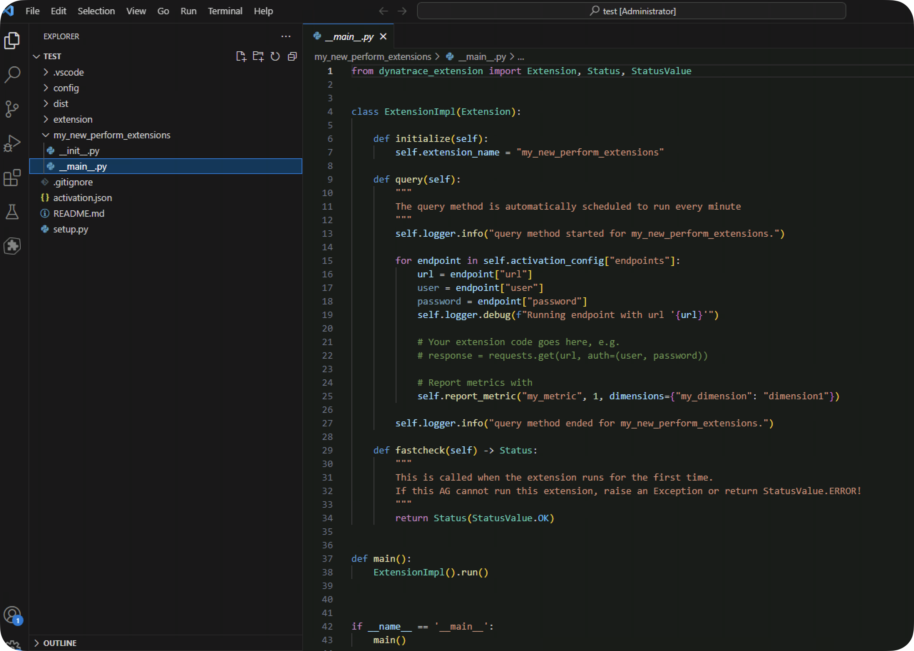
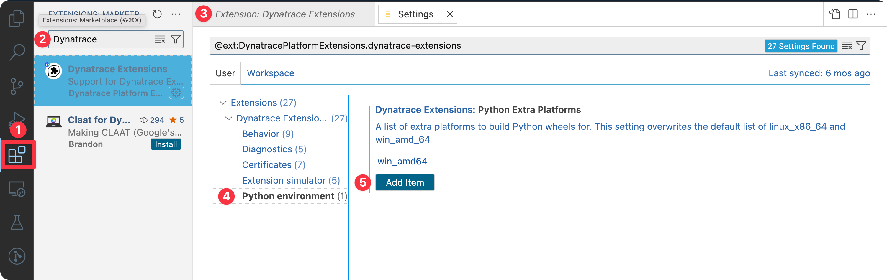

## Getting started with dt-extensions-sdk

### Using dt-sdk

The v2 SDK is a fully featured SDK that allows you to create, build, sign and deploy a Python extension. In this course, we will focus on using the SDK through the VS Code extension.  

`dt-extensions-sdk` is available on [PyPi](https://pypi.org/project/dt-extensions-sdk/) with [detailed](https://dynatrace-extensions.github.io/dt-extensions-python-sdk/) documentation. 

To try the SDK directly:

1. Create a directory to test using `dt-sdk` directly 
    - `test_directory`
2. Create and activate a virtual environment
    - `py -m venv venv`
    - `.\venv\Scripts\Activate.ps1`
3. Install the SDK
   - `pip install 'dt-extensions-sdk[cli]'`
4. Confirm the install
   - `dt-sdk --help`
5. Initialize an extensions
   - `dt-sdk create my-extension-name`
6. Explore the extension scaffolding created

You can now open this folder in the code editor of your choice and continue work on your extension. 

### Using the VS Code Dynatrace Extension

1. Choose the Dynatrace Extension in the sidebar
2. Click "Initialize" or "+". 
3. Choose (or create) a folder.
4. Choose a version of the schema (1.280).
5. If necessary, agree to download the schemas and generate keys, otherwise use existing certs and schemas.
6. Choose "Python Extensions 2.0".
7. Name your extension.
8. Examine the created scaffolding.
9. Type "Dynatrace" in the Command Palette to familiarize yourself with the commands that are available to use in the extension. 

#### Modify the `extra-platform` setting

When the extension is built, dependencies are collected and bundled automatically. Some Python libraries have platform specific build requirements. In most cases, the Extension will choose an appropriate distribution automatically but there are some libraries that use a non-standard naming format that make this impossible. The `psutil` library used by this extension uses non-standard naming of it's compiled distributions so we need to make a quick change to our build settings.

1. Click on the **Extensions** icon in the Sidebar and search for "Dynatrace". 
2. Click on the gear icon and "Extension Settings".
3. Expand the menu, and click on "Python environment".
4. In the "Python Extra Platform" settings, click "Add item" and type `win_amd64` (Make sure to click "OK" when finished). 

This updates our build settings and provides us with a Windows-only build which is perfect for our use case.

See the [psutil download page](https://pypi.org/project/psutil/#files) for details on available distributions.