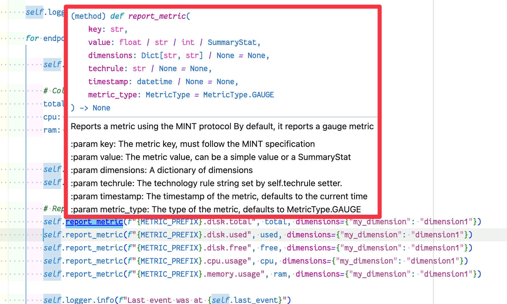

## Converting the Python Code

For many relatively simple extension, converting your Python code to v2, should be quite straightforward. Most key methods from the SDKs function similarly.

From the earlier section that [highlighted key differences between EF1 and EF2](../02_ef1_to_ef2_comparision/index.md), we see that: 

### Method Conversion

| Purpose                | EF1                                              | EF2                                                         |
| ---------------------- | ------------------------------------------------ | ----------------------------------------------------------- |
| Logging                | `self.logger.info('message')`                    | `self.logger.info('message')`                               |
| Get user configuration | `self.config.get('param_name', 'default_value')` | `self.activation_config.get('param_name', 'default_value')` |
| Report an event        | `self.results_builder.report_custom_info_event`  | `self.report_dt_event`                                      |
| Report a metric        | `device.absolute`                                | `self.report_metric`                                        |

### New Methods

| Purpose                    | Method                   |
| -------------------------- | ------------------------ |
| Report a log event         | `self.report_log_event`  |
| Report multiple log events | `self.report_log_events` |
| Report multiple metrics    | `self.report_mint_lines` |
| Schedule a method          | `self.schedule`          |


### Code Conversion

As with `ActivationSchema.json` that we previously worked with, the SDK provides the developer with `__main__.py` scaffolding that makes it quick to get started with a conversion (or a new extension).

#### Add the Imports

First, let's add the imports from the v1 of extension. 

From `perform_plugin.py`:

```python
from datetime import datetime, timedelta
import logging

import shutil
import psutil
```

In `__main__.py`, simply copy those imports above the "from dynatrace_extension..." import.


`__main__.py`

```python
"""
Main exension file
"""
from datetime import datetime, timedelta
import shutil
import psutil

from dynatrace_extension import Extension, Status, StatusValue, DtEventType
```

#### Add metric prefix 

In a future step, we will report metrics to Dynatrace. To keep our metrics consistent, discoverable and useful for topology it is useful to ensure that all metrics sent to Dynatrace will have the same metric prefix. We can define this as a constant below the imports.

```python
from dynatrace_extension import Extension, Status, StatusValue, DtEventType

METRIC_PREFIX = "custom.perform_host_performance"
```

#### Add class variables and log activation_config

In v1, class variables are defined in the main body of the class. Version 2, introduces a special `initialize` method when the extension loads for the first time. 

In this method, can also log the `activation_config`. This allows us to view the structure of the configuration we receive and is very useful during development.

Define the class variable here, and remember that since this is a method of the main class to prefix the variables with `self`.

From `perform_plugin.py`:

```python
class PerformHostPerformancePlugin(BasePlugin):
    """
    Main class of extension
    """
    
    last_metric_report: datetime = datetime.now()
    last_event: datetime = datetime.now()
```

In `__main__.py`:

```python
    def initialize(self):
        self.extension_name = "python_perform_host_performance"

        self.last_event = datetime.now()

        self.logger.debug(self.activation_config)
```

#### Update the query method to collect the metric data

Monitoring configurations in version 2 extension can use multiple "endpoints". The scaffolding code iterates through each of the defined endpoints and executes the extension code according to the parameters defined by each endpoint.

The logic of our extension exists with this "endpoint" loop.

1. During development, log the endpoint configuration.
2. Collect the metrics exactly as in v1.
3. During development, log the collected metric data.

From `perform_plugin.py`:

```python
    def query(self, **kwargs):
        
        logger.info("Starting PerformHostPerformancePlugin")

        # Collect the metrics
        total, used, free = shutil.disk_usage(__file__)
        cpu: float = psutil.cpu_percent(percpu=False)
        ram: float = psutil.virtual_memory().percent
```

In `__main__.py`:

```python
        for endpoint in self.activation_config["endpoints"]:
            self.logger.info(f"Endpoint: {endpoint}")

            # Collect the metrics
            total, used, free = shutil.disk_usage(__file__)
            cpu: float = psutil.cpu_percent(percpu=False)
            ram: float = psutil.virtual_memory().percent


            self.logger.debug("Testing Metric Collection")
            self.logger.debug(f"Free -> {free} bytes, CPU -> {cpu:2.2f}%, RAM -> {ram:2.2f}%")
```
#### Report the metrics

In version 1, we used a very basic custom scheduler to enforce the user defined reporting interval. Version 2 add a much more robust method for handling scheduling, we will return to this later. For now we will report metrics according to the `query` methods fixed 1 minute interval.

From `perform_plugin.py`:

```python
    self.results_builder.absolute(key='disk.used', value=used)
    self.results_builder.absolute(key='disk.free', value=free)
    self.results_builder.absolute(key='disk.total', value=total)
    self.results_builder.absolute(key='cpu.usage', value=cpu)
    self.results_builder.absolute(key='memory.usage', value=ram)
```

Instead of the `results_builder`, version 2 uses `self.report_metric()`. If your VS Code environment is correctly configured, you should see tool tips that will explain this (and all other SDK methods).



To convert between the two methods, simply transfer the metric keys (add the `METRIC_PREFIX` from above) and values to `report_metric`. The example also includes a test dimension to show how adding dimension data works. 

In `__main__.py`:

```python
    # Report metrics with
    self.report_metric(key=f"{METRIC_PREFIX}.disk.total", value=total, dimensions={"my_dimension": "dimension1"})
    self.report_metric(key=f"{METRIC_PREFIX}.disk.used", value=used, dimensions={"my_dimension": "dimension1"})
    self.report_metric(key=f"{METRIC_PREFIX}.disk.free", value=free, dimensions={"my_dimension": "dimension1"})
    self.report_metric(key=f"{METRIC_PREFIX}.cpu.usage", value=cpu, dimensions={"my_dimension": "dimension1"})
    self.report_metric(key=f"{METRIC_PREFIX}.memory.usage", value=ram, dimensions={"my_dimension": "dimension1"})
```

#### 