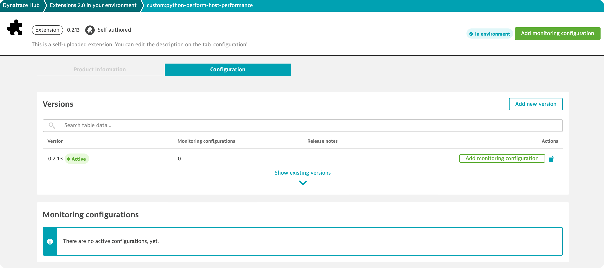

## Building and Activating the extension

### Build and Upload 

Building the extension is simple using the Dynatrace VS Code Extension. Simply make sure your files are all saved to their latest version, activate the Command Palette and type "Build" until "Dynatrace Extensions: Build" becomes highlighted.

The command will take several seconds to run and, if successful, prompt you to upload and active your extension. 

If there is a failure, an error will be provided. Carefully read through the info and make the necessary adjustment before you try to build again.

Alternatively, you can invoke a SDK to build the extension.

In a terminal, with your virtual environment active type:

```bash
dt-sdk build
dt-sdk upload
```

### Activate the Extension



1. Click "Add monitoring configuration".
2. Select the host to deploy the extension to (HINT: there should only be one choice!).
3. Add an endpoint and configure a query frequency (this feature is not let implemented so set it to one for now).
4. Click next, set a configuration name and click "Activate". 

You are done!

It will now take the cluster about five minutes to deploy your extension to the correct hosts and for the extension execution controller on that host to begin to run the extension. In five to ten minutes you will begin to see data coming through.

Head to the **Data Explorer** and search for the metric names that you created.

If you successfully followed the lab to this point, you know have a working extension built using the version 2 extension framework. In the next sections, we will define a topology and a basic unified analysis screen and add a bundled dashboard.